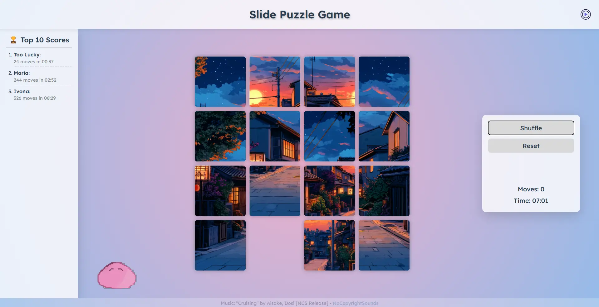
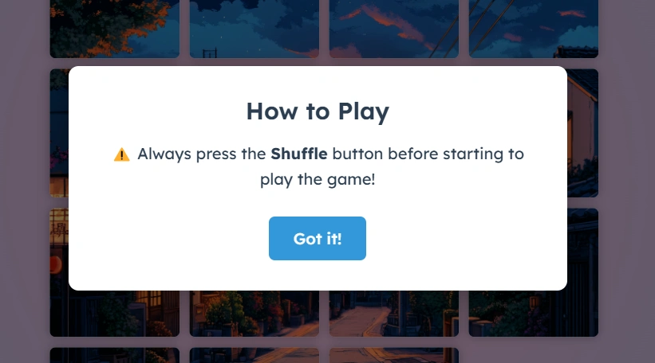
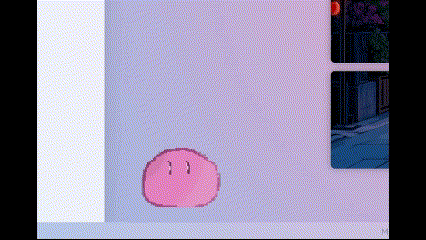

#  Sliding Puzzle Game

An interactive 4x4 sliding puzzle game implemented with vanilla JavaScript, CSS Grid, and responsive design.

## ✨ Features

- **🖱️ Interactive Tile Movement**: Click on tiles adjacent to the empty space to move them
- **⌨️ Keyboard Controls**: Use arrow keys to slide tiles (Up, Down, Left, Right)
- **📊 Game Statistics**: Track moves and time taken to solve the puzzle
- **🔀 Shuffle**: Randomize the puzzle with 100 random moves
- **🔄 Reset**: Return the puzzle to its solved state
- **🏆 Win Detection**: Automatically detects when the puzzle is solved
- **📱 Responsive Design**: Adapts to different screen sizes
- **🌊 Smooth Animations**: Tile movements have smooth transitions

## 🎮 How to Play

1. Start by clicking the "Shuffle" button to randomize the puzzle
2. Move tiles by either:
   - Clicking on a tile adjacent to the empty space
   - Using arrow keys to move tiles in the corresponding direction
3. The goal is to arrange the tiles in numerical order from 1-15, with the empty space in the bottom right corner
4. The game tracks your moves and time ⏱️
5. When you solve the puzzle, a congratulation message will appear, where you can put your name ✍️
6. In the sidebar, your score will appear if it is in Top 10 Best Score 🏅
7. Click "Reset" to start over with the puzzle in its solved state

- Optional: you can press the Player Icon to play some music in the background 🎵 (you can press it again to pause it)

## ⚠️ Warning Pop-up after Refreshing

## 🎬 Demo Video

#### Added a small Dango animation

## 🛠️ Technical Implementation

The game is built using:

- **🌐 HTML5**: Semantic structure and layout
- **🎨 CSS3**: Styling with Grid layout and transitions
- **⚙️ JavaScript**: Game logic and event handling

### 📁 File Structure

- `index.html`: Main HTML structure
- `styles.css`: Styling for the game
- `program.js`: Game logic and functionality
- `img/`: Folder containing the puzzle tile images
- `audio/`: Folder containing the audio of the game

### 🧠 Game Logic

- A 4x4 grid array tracks the position of each tile
- Tiles are positioned using CSS Grid
- Move validation ensures only valid moves are allowed
- The game automatically starts when the first move is made
- Solution checking compares the current grid state to the solved state

## 🚀 Future Improvements

- Multiple difficulty levels (3x3, 4x4, 5x5) 🔢
- Custom image upload 🖼️
- Sound effects 🔊
- Touch swipe support for mobile devices 📱
